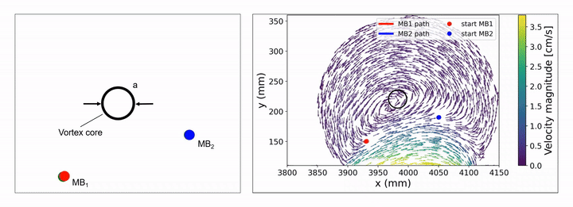
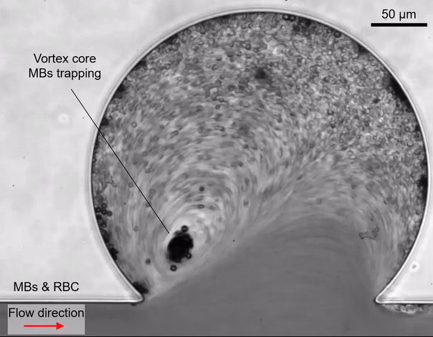
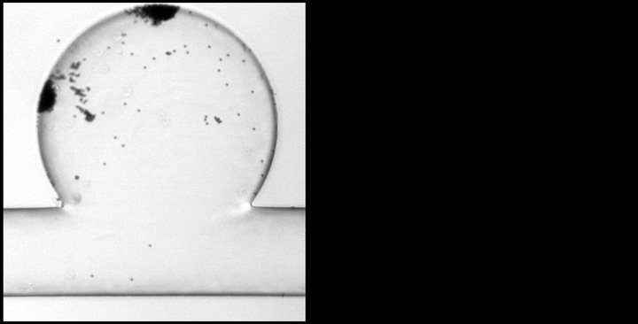

# Ultrasound-induced Particle Dynamics in Pathological Vascular Vortices

Code and data accompanying the manuscript:

> **Ultrasound-induced Particle Dynamics in Pathological Vascular Vortices**
> Mahmoud Medany<sup>1,2</sup>, Nitesh Nama<sup>3</sup>, Daniel Ahmed<sup>1,2\*</sup>
>
> <sup>1</sup> Acoustic Robotics Systems Lab, ARTORG Center for Biomedical Engineering Research, Faculty of Medicine, University of Bern, Switzerland
> <sup>2</sup> Acoustic Robotics Systems Lab, Department of Mechanical and Process Engineering, ETH Zurich, Switzerland
> <sup>3</sup> Department of Mechanical & Materials Engineering, University of Nebraska-Lincoln, USA
>
> **Preprint:** [doi.org/10.1101/2025.10.23.684129](https://doi.org/10.1101/2025.10.23.684129)

---

## Overview

In physiological aneurysm-like microfluidic models, clinically approved microbubbles (MBs) under ultrasound migrate into vortex cores, self-cluster through acoustic interactions, and — on reaching a critical aggregate size (~15 µm) — are expelled and anchor at the cavity wall. Repetition of this **capture → growth → ejection → anchoring** cycle fills aneurysm-like cavities on a seconds timescale.


This repository contains the theoretical-model implementation, the experimental tracking code, and the post-processing that produces the published figures.

---

## Supplementary movies

Animated previews are shown below; full-resolution MP4 versions are in [`Videos/`](Videos/).


**Movie 1** | Flow structure within the aneurysm cavity under continuous and pulsatile conditions. Flow within the aneurysm cavity at an inlet velocity of 60 cm s⁻¹ is shown at 0.2× real time. High-speed imaging (0.01× real time) resolves 1 µm tracer particles, revealing intracavity recirculation and vortex formation. A side-by-side comparison of continuous (left) and pulsatile (right) flow highlights vortex persistence under both conditions.


**Movie 2** | Ultrasound-driven microbubble convergence to the vortex eye. Two microbubbles recirculate within the aneurysm cavity under continuous ultrasound. Both progressively spiral inward and converge at the vortex eye, where they become trapped.



**Movie 3** | Simulated microbubble trajectories within a vortex flow field. Two microbubbles released from distinct entry positions are numerically simulated within a COMSOL-derived velocity field of the aneurysm cavity. The trajectories reproduce inward spiralling and convergence to the vortex eye under ultrasound forcing.


**Movie 4** | Microbubble clustering and ejection from the vortex eye. Multiple microbubbles enter the aneurysm cavity under continuous ultrasound and are drawn into the vortex eye, where they progressively cluster. Doublets, triplets, and larger aggregates form within the low-shear core. As the cluster approaches a critical radius (~15 µm), confinement destabilizes and the aggregate is abruptly ejected from the vortex eye, exiting the recirculation zone. Ultrasound remains on throughout.



**Movie 5** | Microbubble trapping in mouse blood under ultrasound. Microbubbles dispersed in anticoagulated mouse blood are introduced into the aneurysm cavity under continuous flow. Upon ultrasound activation, microbubbles are drawn into the vortex eye, where they cluster and remain trapped, while blood cells predominantly follow streamlines and bypass the trapping region. Ultrasound remains on throughout.



**Movie 6** | Repeated microbubble cluster ejection from the vortex eye. High-speed imaging captures the ejection dynamics of microbubble clusters under continuous ultrasound. Clusters assemble at the vortex eye, grow through recruitment, and are abruptly expelled from the core. The sequence illustrates repeated capture–growth–ejection cycles under sustained acoustic excitation.


**Movie 7** | Ultrasound on/off control of microbubble trapping. Microbubble behaviour within the aneurysm cavity is shown at 0.2× real time. With ultrasound on, microbubbles cluster at the vortex eye. When ultrasound is switched off, clusters disperse and microbubbles leave the core following background recirculation. Reapplication of ultrasound restores clustering.


**Movie 8** | Progressive aneurysm cavity filling under pulsatile flow. A high-concentration microbubble suspension is introduced under pulsatile flow in the main channel (60–90 cm s⁻¹). With continuous ultrasound, microbubbles are redirected into the cavity, captured at the moving vortex eye, and accumulate along the inner wall. Repeated capture–growth–ejection cycles lead to progressive cavity filling.


**Movie 9** | Ultrasound-guided microbubble accumulation in a millimeter-scale aneurysm sac. A three-dimensional, millimeter-scale aneurysm sac is exposed to continuous ultrasound. Microbubbles are guided into the cavity, where they accumulate and progressively occupy the sac volume, illustrating partial volumetric filling under sustained acoustic excitation.

---

## Model

The complete formulation — force balance, Rankine confinement, and the ejection criterion — is given in **Supporting Information, Notes 1–2 (Eqs. S1–S5)** of the manuscript. This section covers only what the code implements.

The solver models the **capture stage**: two independent MBs released into the measured 2-D carrier flow. Secondary Bjerknes forces, wall images, and explicit primary radiation forcing are **intentionally omitted** here (see Supporting Note 2) — those are treated analytically in the clustering/ejection analysis. For each bubble $i = 1,2$:

$$\dot{\mathbf{x}}_i = \mathbf{v}_i, \qquad \dot{\mathbf{v}}_i = -\frac{3}{\rho}\nabla p_{\text{rank}}(\mathbf{x}_i; \mathbf{x}_c, a, \Gamma) + 0.75\,C_D\left(\mathbf{u}_f(\mathbf{x}_i) - \mathbf{v}_i\right)\lVert \mathbf{u}_f(\mathbf{x}_i) - \mathbf{v}_i \rVert$$

where $\mathbf{u}_f$ is the measured carrier field, $p_{\text{rank}}$ the Rankine pressure surrogate (Eq. S3), $C_D$ an effective quadratic drag constant, and $\rho$ the fluid density. This reproduces inward spiralling and convergence to the vortex eye across entry angles (Fig. 2D–E).

**Implementation:** carrier field interpolated by inverse-distance k-nearest neighbours (k = 8) over a `scipy.spatial.cKDTree`; vortex centre found by minimising the radial velocity component; integration by `solve_ivp` (RK45, `rtol=1e-6`, `atol=1e-9`), terminating if a bubble leaves the measured domain. The time horizon is split into CPU-count subintervals integrated sequentially, each seeded from the previous terminal state (Windows spawn-safety; bounds step size). Output is `outputs/trajectory_two_mb.csv`.


---

## Running

```bash
git clone https://github.com/M-Medany/Ultrasound-induced-Particle-Dynamics-in-Pathological-Vascular-Vortices-.git
cd Ultrasound-induced-Particle-Dynamics-in-Pathological-Vascular-Vortices-

python -m venv .venv
.venv\Scripts\activate          # Windows
source .venv/bin/activate       # macOS / Linux

pip install -r requirements.txt
```

Run the capture solver:

```bash
python scripts/figures/two_microbubble_capture.py
```

Parameters are in the `USER CONFIG` block at the top of the script:

| Parameter | Default | Meaning |
|---|---|---|
| `CSV_PATH` | `data/comsol/Velocity_2d_5cm.csv` | COMSOL carrier field |
| `rho` | `1000.0` | Fluid density (kg m⁻³) |
| `CD` | `5` | Effective quadratic drag constant |
| `Gamma` | `0.95` | Circulation (CSV units) |
| `a_override` | `15` | Core radius; `None` to auto-detect from peak speed |
| `x0_1, y0_1` / `x0_2, y0_2` | — | MB release positions (must lie inside the CSV domain) |
| `rtol, atol` | `1e-6, 1e-9` | RK45 tolerances |

Figures are regenerated by running [`plotting/Plotting_filling_Aneurysm.ipynb`](plotting/Plotting_filling_Aneurysm.ipynb) top to bottom.

Requires Python 3.11. Tested on Windows with the pinned versions in [`requirements.txt`](requirements.txt).

---

## Repository organization

`scripts/` is split by purpose so the manuscript's actual implementation is easy to find:

- **[`scripts/figures/`](scripts/figures/)** — the canonical scripts that produce the published figures. If you only run one thing, run something from here.
- **[`scripts/tracking/`](scripts/tracking/)** — experimental video-tracking and bubble-cluster-area analysis code.
- **[`scripts/exploratory/`](scripts/exploratory/)** — parameter-exploration variants kept for provenance (different flow speeds, drag constants, normalizations, an acoustic-bias branch, etc.). These document the exploration that led to the final model but are **not** the manuscript implementation. `scripts/exploratory/legacy/` holds a couple of early, superseded scripts kept only as a record.

Two more top-level folders keep run artifacts out of the repo root:

- **[`plotting/`](plotting/)** — the analysis/plotting notebooks and the static figures the model scripts generate.
- **[`outputs/`](outputs/)** — trajectory CSVs written by the model scripts.

---

## Where each figure comes from

| Manuscript figure | Source |
|---|---|
| Fig. 2B — velocity profile, polar plot | [`plotting/Plotting_filling_Aneurysm.ipynb`](plotting/Plotting_filling_Aneurysm.ipynb) cells 22–23 ← `PIV_Velocity_Vortex_center.csv` |
| Fig. 2D — trajectory-only capture panels | [`scripts/figures/two_microbubble_trajectory_only.py`](scripts/figures/two_microbubble_trajectory_only.py) |
| Fig. 2E — velocity field + capture trajectory | [`scripts/figures/two_microbubble_capture.py`](scripts/figures/two_microbubble_capture.py) |
| Fig. 2E inset — Rankine pressure well | [`scripts/figures/rankine_schematic.py`](scripts/figures/rankine_schematic.py) |
| Fig. 3F — cluster area at ejection | notebook cells 12–16, 21 ← `Bubble_shooting[_updated].csv` |
| Fig. 3G — US on/off control | notebook cells 10–11 |
| Fig. 4D — pulsatile cavity filling | notebook cells 6–7 ← `Filling_Mean_Pulsatile.csv` |
| Fig. S5 — ejection speed traces (n = 5) | notebook cells 17–20 |
| Fig. S6B — continuous cavity filling | notebook cells 3–5 ← `Filling_Mean_STD_integer_seconds.csv` |

---

## Repository contents

| Path | Contents |
|---|---|
| [`scripts/figures/`](scripts/figures/) | Canonical model and figure-generation scripts (see above) |
| [`scripts/tracking/`](scripts/tracking/) | `manual_tracking.py` (`EuclideanDistTracker` — nearest-neighbour ID assignment across frames) and `bubble_tracking.py` (MOG2 background subtraction → contour detection → per-ID trajectory overlay) |
| [`scripts/exploratory/`](scripts/exploratory/) | Parameter-exploration variants and superseded drafts, kept for provenance |
| [`plotting/`](plotting/) | Analysis/plotting notebooks and the static figures they and the model scripts generate |
| [`outputs/`](outputs/) | Trajectory CSVs written by the model scripts |
| [`data/experimental/`](data/experimental/) | Experimental measurements: filling fractions, cluster areas, PIV vortex-centre velocities |
| [`data/comsol/`](data/comsol/) | COMSOL velocity fields, columns `x, y, u, v` |
| [`Figures/`](Figures/) | Generated figure outputs (PNG + SVG) |
| [`Videos/`](Videos/) | Experimental footage and animations |

---

## Citation

The manuscript is currently under review. Until a formal publication record is available, please cite the preprint:

```bibtex
@article{medany2025ultrasound,
  title   = {Ultrasound-induced Particle Dynamics in Pathological Vascular Vortices},
  author  = {Medany, Mahmoud and Nama, Nitesh and Ahmed, Daniel},
  journal = {bioRxiv},
  year    = {2025},
  doi     = {10.1101/2025.10.23.684129}
}
```

---

## License

- **Code** ([`scripts/`](scripts/), notebooks) — [MIT License](LICENSE)
- **Data and media** ([`data/`](data/), [`Figures/`](Figures/), [`Videos/`](Videos/)) — [CC BY 4.0](https://creativecommons.org/licenses/by/4.0/)

Reuse of either is permitted with attribution.
