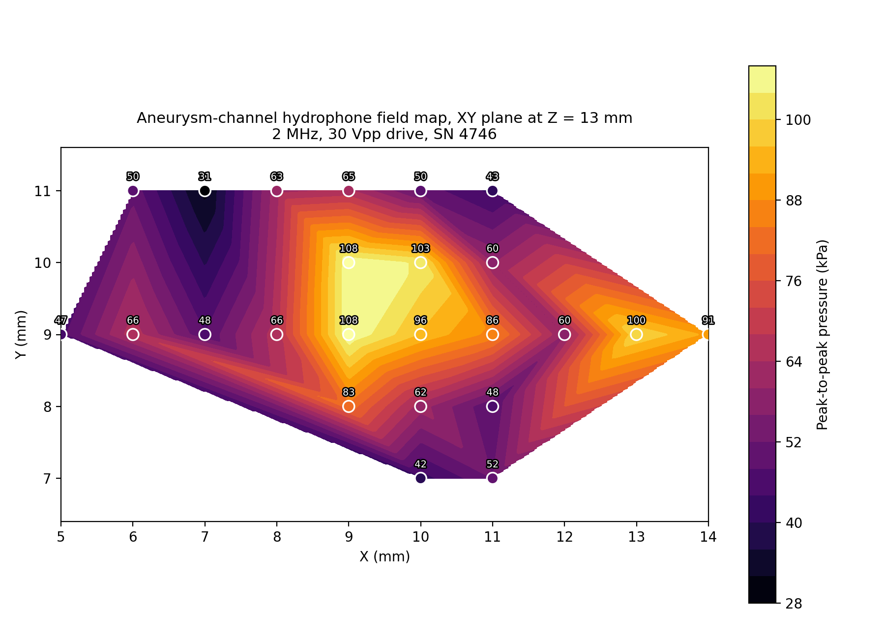

# Hydrophone field map — 3D aneurysm channel (2 MHz)

Needle-hydrophone spatial scan of the transducer field through the 3D aneurysm
channel, single XY plane at Z = 13 mm, 2 MHz / 30 Vpp, in water.
Precision Acoustics hydrophone SN 4746, 50 Ω termination.

## Field map



*Interpolated peak-to-peak pressure across the scanned plane (see also
`figures/field_profiles.png`).*

## Contents

- `raw_csv/` — 24 raw oscilloscope waveforms, `CSV{n}_X{x}_Y{y}_Z{z}.csv`
  (n = 00–23 in acquisition order; Tektronix TBS2072, `TIME`/`CH1` in s/V,
  2000 points, 8 ns interval). X/Y/Z in mm.
- `data_table.csv` — one row per point: `CSV, X_mm, Y_mm, Z_mm, Vpp_mV, Pressure_pp_kPa, RawFile`.
  `Vpp_mV` is full-trace peak-to-peak; `Pressure_pp_kPa = Vpp / 654.0046 * 1000`, using the
  calibrated sensitivity at 2 MHz (certificate 20251211-03, ~8% uncertainty).
- `plot_field.py` — regenerates the figures in `figures/`.

Scan covers roughly X = 5–14 mm, Y = 7–11 mm (denser near X = 9–11, Y = 8–11).
See the paper and its supplementary note for full experimental context.

## Regenerating the figures

```bash
pip install numpy scipy matplotlib
python3 plot_field.py
```
