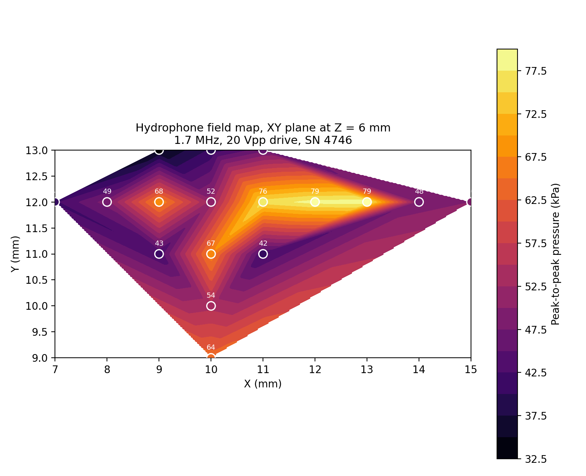

# Hydrophone field map — quasi-2D PDMS channel (1.7 MHz)

Needle-hydrophone spatial scan of the transducer field, 1.7 MHz / 20 Vpp, in water.
Precision Acoustics hydrophone SN 4746, 50 Ω termination.

## Field map



*Interpolated peak-to-peak pressure across the scanned plane (see also
`figures/field_profiles.png` and `figures/field_scatter_3D_channel_style.png`).*

## Contents

- `raw_csv/` — 19 raw oscilloscope waveforms, `CSV{n}_X{x}_Y{y}_Z{z}.csv`
  (Tektronix TBS2072, `TIME`/`CH1` in s/V, 2000 points, 8 ns interval). X/Y/Z in mm.
- `data_table.csv` — one row per point: `CSV, X_mm, Y_mm, Z_mm, Vpp_mV, Pressure_pp_kPa`.
  `Vpp_mV` is full-trace peak-to-peak; `Pressure_pp_kPa = Vpp / 655.63 * 1000`, using the
  calibrated sensitivity at 1.7 MHz (certificate 20251211-03, ~8% uncertainty).
- `plot_field.py`, `plot_field_3D_channel_style.py` — regenerate the figures in `figures/`.
- `Precision_Acoustics_Calibration_Certificate_20251211-03.pdf` — hydrophone calibration.

See the paper and its supplementary note for full experimental context.

## Regenerating the figures

```bash
pip install numpy scipy matplotlib
python3 plot_field.py
python3 plot_field_3D_channel_style.py
```
